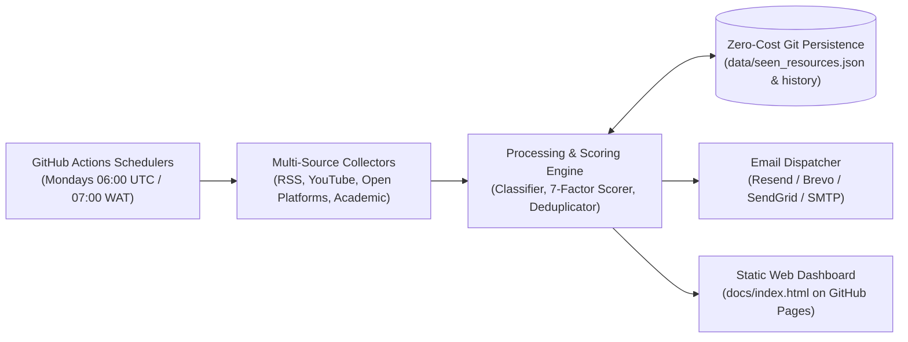

# Free L&D / Talent Management Career Development Intelligence & Email Alert System


An automated personal career development intelligence system designed specifically for **Emuesiri Jessica Agbabune** (Head / Learning & Development Manager at **TD Africa**) to accelerate progression from L&D management into strategic **Talent Development, Talent Management, and Executive HR Leadership**.

---

## 1. What the System Does
This is **not a generic HR newsletter**. The system acts as a personal **Career Development Intelligence Assistant**:
- **Discovers & Filters**: Continuously searches authoritative global institutions (CIPD, SHRM, ATD, CIPM Nigeria, Harvard, MIT, Stanford, McKinsey, WEF) for newly released learning opportunities.
- **Prioritizes Free Resources First**: Strongly filters for **100% free courses, university lectures, open courseware, toolkits, and free-audit tracks** (Coursera/edX).
- **Personalized 7-Factor Scoring (0–100)**: Evaluates career relevance, TD Africa L&D applicability, talent management depth, source credibility, accessibility, recency, and value.
- **Weekly Structured Learning Alert (Monday 07:00 WAT)**: Delivers exactly **3 core learning items** (60–90 min total), **1 practical workplace assignment**, **1 portfolio artifact recommendation**, **3 reflection prompts**, and a clear **3-Action summary** (Learn, Apply, Capture).
- **Urgent Critical Alerts**: Flags high-impact opportunities (Score $\ge 90$) such as free Ivy League masterclasses or fully funded fellowships.
- **Monthly Career Intelligence Digest**: Tracks competency growth across a **27-competency matrix**, summarizes research breakthroughs, and detects industry trend directions.
- **Interactive Web Dashboard**: Generates a responsive static dashboard deployed to **GitHub Pages**.

---

## 2. Architecture & Data Flow



---

## 3. How to Install Locally

### Prerequisites
- Python 3.9, 3.10, or 3.11
- Git

### Setup Steps
```bash
# 1. Clone the repository
git clone https://github.com/your-username/LAndDAlert.git
cd LAndDAlert

# 2. Create and activate virtual environment
python3 -m venv .venv
source .venv/bin/activate   # On Windows: .venv\Scripts\activate

# 3. Install dependencies
pip install -r requirements.txt
```

---

## 4. How to Configure

All configurations are located in the `config/` directory:

| File | Purpose |
|---|---|
| [`config/profile.yaml`](config/profile.yaml) | User profile, TD Africa role context, career goals, stage, email settings |
| [`config/sources.yaml`](config/sources.yaml) | 25+ Tier 1/2 trusted sources across professional bodies, universities, platforms |
| [`config/competencies.yaml`](config/competencies.yaml) | 27-competency matrix (current levels, target levels, gaps, practical evidence) |
| [`config/scoring_weights.yaml`](config/scoring_weights.yaml) | Configurable 7-factor weights and priority thresholds (Critical, High, Good, Low) |

---

## 5. How to Add Email Credentials

The email dispatcher supports multiple **free-tier** providers:

### Recommended Option: Resend (Free Tier: 3,000 emails/month)
1. Sign up for free at [resend.com](https://resend.com).
2. Generate an API Key in your dashboard.
3. Set `EMAIL_PROVIDER=resend` and `RESEND_API_KEY=re_...`.

### Option B: Brevo / Sendinblue (Free Tier: 300 emails/day)
1. Sign up at [brevo.com](https://brevo.com).
2. Generate an API Key.
3. Set `EMAIL_PROVIDER=brevo` and `BREVO_API_KEY=xkeysib_...`.

### Option C: Gmail SMTP (Free)
1. In your Google Account, enable 2-Factor Authentication.
2. Go to **Security &rarr; App passwords** and generate an App Password.
3. Set:
   ```env
   EMAIL_PROVIDER=smtp
   SMTP_HOST=smtp.gmail.com
   SMTP_PORT=587
   SMTP_USER=your.email@gmail.com
   SMTP_PASSWORD=your-16-char-app-password
   ```

---

## 6. GitHub Secrets Setup
When hosting on GitHub Actions, configure the following secrets in your repo under **Settings &rarr; Secrets and variables &rarr; Actions &rarr; New repository secret**:

| Secret Name | Value Example | Required? |
|---|---|---|
| `EMAIL_PROVIDER` | `resend` (or `brevo`, `smtp`) | Yes |
| `EMAIL_TO` | `emuesiri.agbabune@yourdomain.com` | Yes |
| `EMAIL_FROM` | `Emuesiri's Assistant <onboarding@resend.dev>` | Yes |
| `RESEND_API_KEY` | `re_123456789...` | If using Resend |
| `BREVO_API_KEY` | `xkeysib_...` | If using Brevo |
| `SMTP_USER` | `your.email@gmail.com` | If using Gmail SMTP |
| `SMTP_PASSWORD` | `your-app-password` | If using Gmail SMTP |

---

## 7. How to Add Sources

To add a new trusted source, open [`config/sources.yaml`](config/sources.yaml) and add an entry:

```yaml
- id: "custom_hr_feed"
  name: "Custom HR Institute Research"
  url: "https://example.org/hr"
  feed_url: "https://example.org/hr/rss.xml"
  type: "rss"          # "rss", "youtube", or "platform"
  tier: 1              # 1 (Top Authority), 2 (Established Platform), 3 (Independent)
  category: "professional_body"
  topics: ["Talent Management", "Succession Planning"]
  pricing_bias: "mostly_free"
  enabled: true
```

---

## 8. How to Change Topics & Development Areas

To expand or modify targeted topic areas, update the `topics` dictionary in [`src/engine/classifier.py`](src/engine/classifier.py) and the `CORE_TOPICS` list in [`src/search/query_generator.py`](src/search/query_generator.py).

---

## 9. How to Change Learning Stage & Goals

Update [`config/profile.yaml`](config/profile.yaml):
```yaml
career_progression:
  current_stage: "Stage 4: Talent Development & Talent Management"
  target_stage: "Stage 5: Enterprise Talent / Strategic HR Leadership"
```

---

## 10. How to Run Locally

```bash
# View system status, Lagos time, and top competency gaps
python -m src.main status

# Harvest and rank opportunities across all sources
python -m src.main collect

# Update a competency upon verified progress
python -m src.main update-competency --id succession_planning --level 3 --evidence "Piloted 9-box grid for sales leaders"

# Log learning feedback or completion
python -m src.main record-learning --url "https://example.com/course" --status COMPLETED --rating 5 --learning "Learned 9-box calibration protocols"
```

---

## 11. How to Run Tests

Run the complete test suite (20 automated offline unit and integration tests):
```bash
pytest tests/ -v
```

---

## 12. How to Run in Dry-Run Mode

Simulate workflows without sending emails or mutating persistent state:
```bash
# Weekly Alert Dry Run
python -m src.main run --type weekly --dry-run

# Urgent Critical Alert Dry Run
python -m src.main run --type urgent --dry-run

# Monthly Digest Dry Run
python -m src.main run --type monthly --dry-run
```

---

## 13. How GitHub Actions Work
Workflows are defined in `.github/workflows/`:
1. **`weekly.yml`**: Runs automatically every Monday at **06:00 UTC** (**07:00 Africa/Lagos WAT**). Harvests, ranks, compiles the weekly 3-Core plan, sends the email, and commits updated state to the repo with `[skip ci]`.
2. **`daily.yml`**: Runs daily at 06:00 UTC to check for score $\ge 90$ critical urgent opportunities.
3. **`monthly.yml`**: Runs on the 1st of every month at 06:00 UTC to generate the monthly capability scorecard and trend briefing.
4. **`tests.yml`**: Runs pytest on every push and pull request.

---

## 14. How to Manually Trigger Workflows

1. Navigate to your repository on GitHub.
2. Click the **Actions** tab.
3. Select **Weekly Learning Alert & Intelligence Workflow** (or Daily / Monthly).
4. Click **Run workflow**, choose `dry_run: false` (or `true` for a preview), and click **Run workflow**.

---

## 15. How to Change Schedule & Timezone

GitHub Actions cron uses **UTC**. Africa/Lagos (West Africa Time) is **UTC+1** year-round:
- To run at **07:00 WAT**, schedule for `0 6 * * 1` (06:00 UTC on Mondays).
- To run at **08:00 WAT**, change cron in `.github/workflows/weekly.yml` to `0 7 * * 1`.

---

## 16. How to Troubleshoot Failures

- **Collector Timeout / Offline Source**: The system is built with resilient error isolation. If a source fails, it records the issue in `data/source_health.json` and continues processing all other sources.
- **Email Authentication Errors**: Verify your API key or SMTP app password in GitHub Secrets. Run `python -m src.main run --type weekly --dry-run` to inspect generated output locally.
- **Check Source Connectivity**: Run `python -m src.main verify-sources` to test HTTP status across all sources.

---

## 17. How to Add New Resource Types

1. Add the new type to `ResourceType` in [`src/models.py`](src/models.py).
2. Add type inference logic in [`src/engine/classifier.py`](src/engine/classifier.py).
3. Update templates in [`src/email/templates/`](src/email/templates/) if special rendering is needed.

---

## 18. GitHub Pages Dashboard Setup

1. In your GitHub repository, go to **Settings &rarr; Pages**.
2. Under **Build and deployment &rarr; Source**, select **Deploy from a branch**.
3. Choose branch `main` and folder `/docs`.
4. Click **Save**. Your interactive dashboard will be live at `https://<your-username>.github.io/LAndDAlert/`!

---

## License
MIT License &copy; 2026 Emuesiri Jessica Agbabune. Designed for personal career acceleration.
